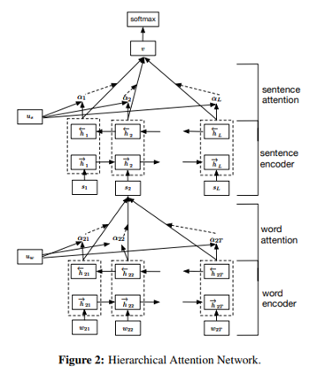
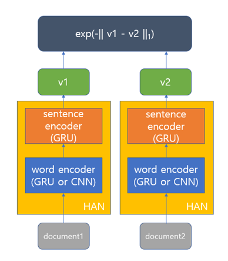
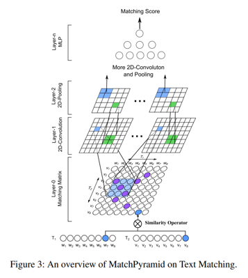

## 문서 유사도 모델 연구 프로젝트

* 과제 : 뉴스 데이터 분류를 위한 문서 유사도 모델 연구
    * 데이터로 한국어 뉴스 쌍과 두 뉴스의 동일 여부에 관한 one-hot label이 주어짐

    * 이때 두 뉴스가 동일하다는 것은 주요하게 다루는 사건이 같다는 의미임

    * 두 뉴스에 비슷한 내용이 포함되더라도 주요하게 다루는 사건이 다르면 동일하지 않다고 레이블링 되어 있음

* 데이터 분포

||동일 뉴스 쌍|비동일 뉴스 쌍|합계|
|:---:|:---:|:---:|:---:|
|학습 데이터|10683 (42%)|14944 (58%)|25627|
|검증 데이터|855 (43%)|1145 (57%)|2000|
|테스트 데이터|770 (39%)|1230 (61%)|2000|

* 사용 모델 및 성능
1. TF-IDF 기반 모델
    
    * TF-IDF (Term Frequency-Inverse Document Frequency)

        * 단어 빈도(TF)와 역 문서 빈도(IDF)를 이용하여 단어마다 중요한 정도를 계산함으로써 문서를 특정 길이의 벡터로 바꿀 수 있는 방법

        * 코사인 유사도와 결합하여 문서 유사도 산출

        * 간단하지만 준수한 성능을 보이는 문서 유사도 측정 방법

    * 성능

        ||accuracy|F1 score|
        |:---:|:---:|:---:|
        |문장 전체 사용|0.8125|0.7538|
        |첫 문장 사용|0.7445|0.5553|
        |첫 세 문장 사용|0.7980|0.7072|
        |고유명사(NNP)만 사용|0.7425|0.6671|

2. HAN 기반 모델

    * HAN (Hierarchical Attention Networks)

        

        * Zichao Yang et al., Hierarchical Attention Networks for Document Classification (2016)

        * 단어가 모여 문장을 구성하고, 문장이 모여 문서를 구성하는 계층적인 구조(hierarchical structure)에 착안한 모델

        * 두 개의 계층으로 구성되어 각각 문장 단위, 문서 단위 임베딩을 수행함

        * 어텐션(attention)을 활용하여 문맥적(contextual)으로 중요한 정보에 가중치를 부여함

        * 문서 쌍이 아닌 하나의 문서를 클래스 분류하는 목적으로 만들어짐
    
    * 모델링 방법

        

        * HAN 모델을 문서 임베딩에 활용하기 위해 클래스 분류에 필요한 마지막 FC 계층과 소프트맥스 계층을 제거

        * 동일 모델을 이용하여 문서 쌍을 임베딩한 후 Manhatten distance(L1 norm)와 exponential function을 이용하여 0~1 범위의 유사도로 변환

        * sentence encoder로는 GRU 계층을 사용하고, word encoder로는 GRU, CNN를 바꿔가며 실험

    * 성능

        ||accuracy|precision|recall|F1 score|비고|
        |:---:|:---:|:---:|:---:|:---:|:---:|
        |GRU|0.7875|0.7566|0.6623|0.7059||
        |GRU|0.8005|0.7639|0.6974|0.7291|pretrained word embedding 사용|
        |CNN|0.7615|0.7640|0.5506|0.6400||
        |CNN|0.7730|0.7548|0.6078|0.6734|pretrained word embedding 사용|

        * 기본적으로 word encoder로 GRU를 사용한 경우 더 성능이 좋음

        * 학습 데이터를 이용하여 미리 학습된 word embedding을 embedding layer의 weight로 주는 경우 accuracy가 1% 이상 향상되었음

3. 매치 피라미드 기반 모델

    * 매치 피라미드 (Match Pyramid)

        

        * Liang Pang et al., Text Matching as Image Recognition (2016)

        * 동일/유사한 문장을 매칭하기 위한 모델

        * 두 개의 문장을 구성하는 각 단어의 상호 유사도로 이루어진 matching matrix를 여러 번 convolution함으로써 문장 간 연관 관계를 단계적으로 추출함 (Word Level Matching → Phrase Level Matching → Sentence Level Matching) → 이미지 인식에 CNN을 활용하는 것과 비슷한 맥락

    * 모델링 방법

        1. 문서로부터 첫 n개 단어를 추출하여 문서를 단어의 시퀀스로서 매칭

        2. bidirectional GRU를 이용하여 문장을 임베딩한 후 문서를 문장의 시퀀스로서 매칭 (GRU + MP)

        3. match pyramid를 이용하여 문장 단위의 유사도를 구해 matching matrix 생성 후 다시 match pyramid를 이용하여 문서 매칭 (MP + MP)

    * 성능

        ||accuracy|precision|recall|F1 score|
        |:---:|:---:|:---:|:---:|:---:|
        |첫 n 단어 (n=128)|0.8280|0.7731|0.7831|0.7781|
        |첫 n 단어 (n=256)|0.8430|0.8048|0.7818|0.7931|
        |GRU + MP|0.8330|0.7868|0.7766|0.7817|
        |MP + MP|0.8335|0.7886|0.7753|0.7819|

        * 학습 데이터를 이용하여 미리 학습된 word embedding을 embedding layer의 weight로 주는 경우 accuracy가 1% 이상 향상되었음

        * 첫 n 단어를 이용하는 모델의 경우 학습 시간이 다른 모델보다 훨씬 짧은 반면 좋은 성능을 보임

        * 배치 정규화(Batch Normalization)을 이용하는 경우 과적합(overfitting)이 완화되고 가중치 초기화에 영향을 덜 받는 등 학습이 더욱 안정적임

* 모델별 장단점

    1. TF-IDF 기반 모델은 간단하면서도 성능이 준수하지만, 단어 카운팅 기반 방법이므로 단어 간 유사성을 고려할 수 없으며 높은 차원의 정보를 추출하는 것이 불가능함

    2. HAN 기반 모델은 문서 임베딩을 바탕으로 문서를 매칭하므로 문서의 핵심 토픽을 상대적으로 잘 파악하지만, 명백한 케이스들을 잘못 분류하는 경우가 종종 있음

    3. 매치 피라미드 기반 모델은 단어 수준의 매칭 결과를 조합하여 문서를 매칭하므로 키워드나 구(phrase) 정보를 잘 활용하지만, 동일 주제의 뉴스가 다른 방식으로 서술되는 경우나 다른 주제의 뉴스가 유사한 단어나 표현을 공유하는 경우 잘못 분류하는 경우가 많음

* 추가적인 모델 개선안

    * 충분한 hyperparameter tuning (모델 hyperparameter 개수가 많음)

    * HAN 기반 모델과 매치 피라미드 기반 모델을 결합하여 앙상블 학습

    * 매치 피라미드 기반 모델에 어텐션(attention) 도입 → 중요 단어가 매칭되었을 때 가중치를 더 많이 주도록 모델링
